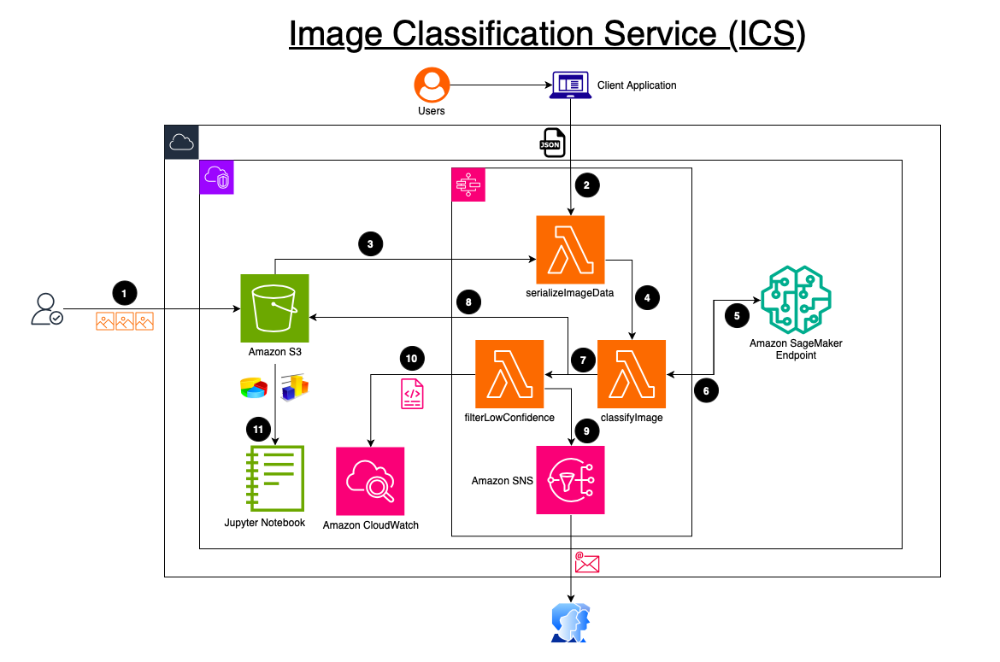
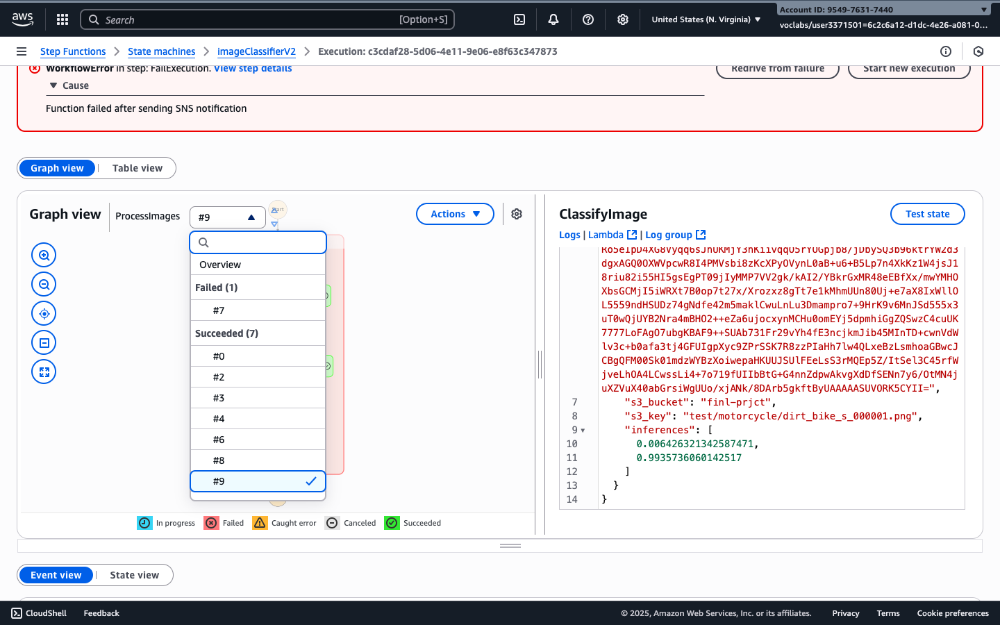
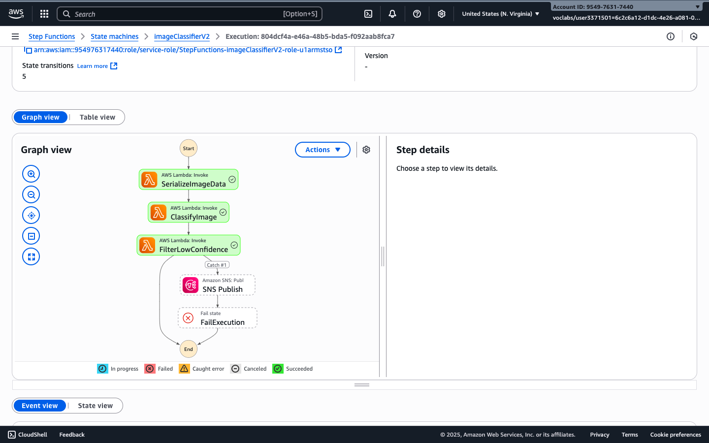
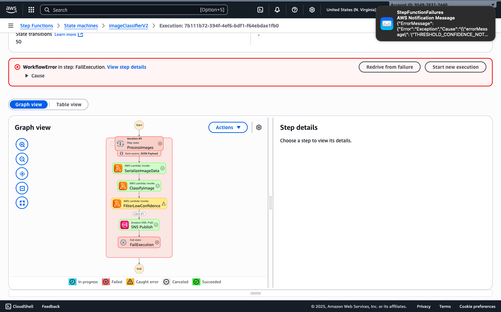
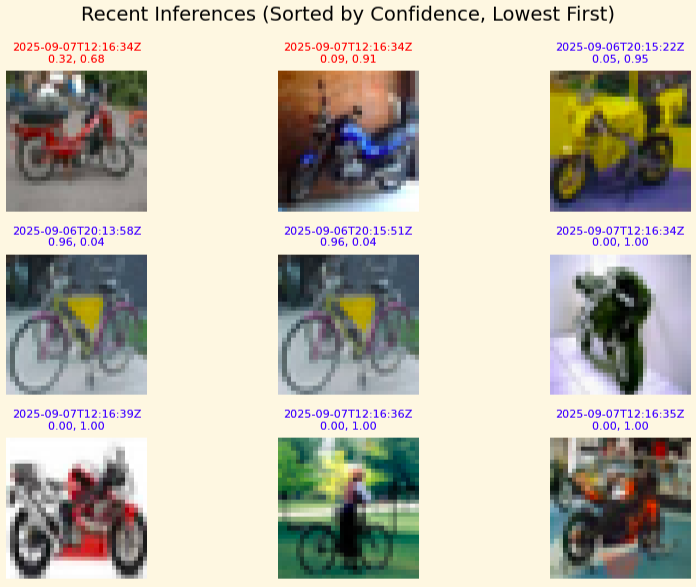

# 🖼️ Image Classification Service (ICS)

## 📜 Description
The **Image Classification Service (ICS)** is a scalable, serverless, and event-driven machine learning pipeline designed to classify images stored in Amazon S3. It leverages AWS Step Functions to orchestrate a sequence of Lambda functions that preprocess images, invoke a SageMaker model endpoint, filter low-confidence predictions, and notify operations teams of failures or uncertain results.

ICS supports both single-image and bulk parallel processing via Step Functions' `Map` state, enabling high-throughput inference with robust error handling and operational visibility.

---

## 🏗️ Solution Architecture

---

## ❗ Problem Statement
Organizations often need to process and classify large volumes of images in real time. Traditional pipelines are often rigid, hard to monitor, and expensive to scale. Without automated error detection and confidence filtering, low-quality predictions can propagate downstream, affecting business decisions and user experience.

---

## 💼 Business Case
ICS solves the challenge of deploying a production-grade image classification pipeline that is:
- **Scalable**: Handles both real-time and batch workloads.
- **Observable**: Surfaces errors and low-confidence predictions.
- **Cost-efficient**: Built entirely on serverless components.
- **Maintainable**: Modular design with clear separation of concerns.

This makes ICS ideal for use cases such as content moderation, product tagging, visual search, and automated metadata generation.

---

## 🎯 Target Customers and Use Cases

The **Image Classification Service (ICS)** is designed for organizations that need scalable, reliable, and automated image classification with built‑in monitoring and alerting. Its flexibility makes it applicable across multiple industries. Below are some target customers and use cases useful for hitting the ground running:

### Target Customers
- **Banks & Financial Institutions**
  - Security and compliance teams needing automated document and ID verification.
  - Fraud detection units monitoring ATM or branch camera feeds for suspicious activity.
- **Educational Institutions (Middle & Elementary Schools)**
  - School administrators managing digital learning platforms with automated content moderation.
  - Safety officers monitoring campus camera feeds for restricted items or unsafe situations.
- **E‑commerce & Retail**
  - Product catalog teams automating image tagging for faster product onboarding.
  - Quality control teams detecting incorrect or low‑quality product images.
- **Transportation & Logistics**
  - Fleet managers classifying vehicle images for maintenance tracking.
  - Automated damage detection for shipments.
- **Healthcare Providers**
  - Medical imaging teams classifying scans for triage or routing to specialists.
  - Patient intake systems verifying uploaded documents or images.

### Example Use Cases
1. **Bank Security Monitoring**  
   A bank integrates ICS with its security camera snapshots. Low‑confidence or anomalous classifications (e.g., detecting objects that should not be present) trigger an **SNS alert** to the security team in real time.

2. **School Content Moderation**  
   A middle school uses ICS to automatically scan and classify images uploaded to its learning management system. Any image flagged as inappropriate or below the confidence threshold is quarantined and an alert is sent to the school’s IT administrator.

3. **E‑commerce Product Tagging**  
   An online retailer uploads new product images to S3. ICS classifies them into categories (e.g., “bicycle” vs. “motorcycle”) and tags them automatically, reducing manual cataloging time.

4. **Logistics Damage Detection**  
   A shipping company photographs packages at each checkpoint. ICS classifies the images and flags any that appear damaged, sending alerts to operations for immediate action.

---

## 💰 Business Benefits & Value Proposition
- **Parallel Inference**: Classify hundreds of images in a single execution using Step Functions fan-out.
- **Confidence Filtering**: Automatically flags predictions below a configurable threshold.
- **Operational Alerts**: Sends notifications via SNS for failed or uncertain classifications.
- **Auditability**: Captures all inputs and outputs for compliance and model monitoring.
- **Extensibility**: Easily swap in new models or add post-processing steps.
- **Zero Infrastructure Management**: Fully serverless, no EC2 or container orchestration required.

---

## 🔄 Workflow
1. **Trigger Execution**: Manually or via an upstream event (e.g., S3 upload).
2. **SerializeImageData Lambda**: Reads image from S3 and encodes it for inference.
3. **ClassifyImage Lambda**: Sends image to SageMaker endpoint and retrieves predictions.
4. **FilterLowConfidence Lambda**: Compares max confidence to threshold (e.g., 0.94).
   - If above threshold → continue
   - If below threshold or error → send SNS alert and fail
5. **SNS Publish**: Sends alert with error context to subscribed channels.
6. **End State**: Execution completes with success or failure.

## 🧰 Technology Stack

| Component         | Purpose                                                                 |
|------------------|-------------------------------------------------------------------------|
| **AWS Step Functions** | Orchestrates the ML workflow and supports parallel execution via `Map`. |
| **AWS Lambda**         | Stateless compute for image serialization, classification, and filtering. |
| **Amazon S3**          | Stores input images and captured inference data.                        |
| **Amazon SageMaker**   | Hosts the ML model endpoint for image classification.                   |
| **Amazon SNS**         | Sends notifications for failed or low-confidence predictions.           |
| **CloudWatch Logs**    | Captures logs for all Lambda executions and workflow steps.             |
| **Python**             | Used for Lambda functions and visualization scripts.                    |
| **Matplotlib & PIL**   | Used for visualizing inference results and decoded images.              |
| **jsonlines**          | Parses SageMaker Model Monitor `.jsonl` capture files.                  |

### Inference Example
